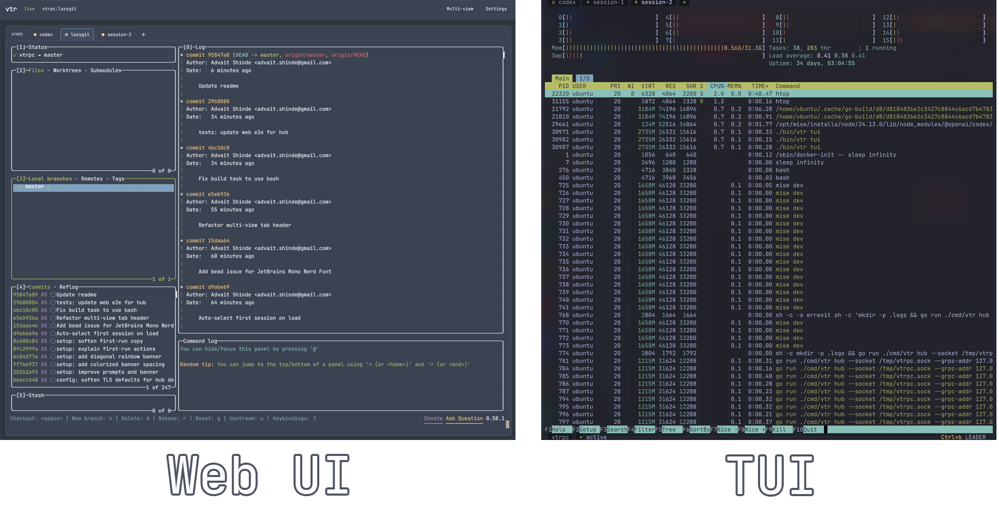

# vtr



vtr (short for vtrpc) is a terminal multiplexer for the agent era. It supports:

- Headless [ghosty](https://mitchellh.com/writing/libghostty-is-coming) vt that exposes screen state
  via gRPC
- Multi-client terminal control including Web UI, TUI, and agent-first CLI
- Ability to run multiple coordinators (terminal engines) on different machines, VMs, and docker
  containers and control them all centrally from any client

## Quickstart

```bash
# Figure out how to get a vtr binary
# TODO

# Setup configuration and keys
vtr setup

# Run hub (coordinator + web ui)
vtr hub

# Access the web UI at http://127.0.0.1:4620
open http://127.0.0.1:4620

# Attach a TUI
vtr tui

# Send commands to a session via CLI
vtr agent spawn my-session-name
vtr agent send my-session-name $'codex\n'
vtr agent send my-session-name $'Controlling codex through CLI!\n'

# See the results in both Web UI and TUI!
```

## Architecture

```
┌────────────────────────────────────────────────────────────────────┐
│                    Coordinator (vtr hub/spoke)                     │
│                                                                    │
│       ┌───────────┐    ┌───────────┐    ┌───────────┐              │
│       │  Session  │    │  Session  │    │  Session  │              │
│       │  "codex"  │    │  "shell"  │    │  "build"  │              │
│       │    PTY    │    │    PTY    │    │    PTY    │              │
│       └─────┬─────┘    └─────┬─────┘    └─────┬─────┘              │
│             │                │                │                    │
│             └────────────────┼────────────────┘                    │
│                              │                                     │
│                              ▼                                     │
│  ┌───────────────────────────────────────────────────────────────┐ │
│  │                         VT Engine                             │ │
│  │            (libghostty-vt via go-ghostty shim)                │ │
│  │         Screen State - Scrollback - Cursor - Attrs            │ │
│  └───────────────────────────┬───────────────────────────────────┘ │
│                              │                                     │
│  ┌───────────────────────────┴───────────────────────────────────┐ │
│  │                         gRPC Server                           │ │
│  │   Spawn - List - GetScreen - SendText - WaitFor - Subscribe   │ │
│  └───────────────────────────┬───────────────────────────────────┘ │
│                              │                                     │
└──────────────────────────────┼─────────────────────────────────────┘
                               │
            Unix Socket or TCP │ (+ WebSocket for Web UI)
                               │
        ┌──────────────────────┼──────────────────────┐
        │                      │                      │
        ▼                      ▼                      ▼
  ┌───────────┐          ┌───────────┐          ┌───────────┐
  │ vtr agent │          │  vtr tui  │          │  Web UI   │
  │   (CLI)   │          │           │          │ (browser) │
  └───────────┘          └───────────┘          └───────────┘
```

## Comparison vs other terminal multiplexers

### vtr vs tmux

| Aspect                  | tmux                                        | vtr                                          |
| ----------------------- | ------------------------------------------- | -------------------------------------------- |
| **Primary audience**    | Humans                                      | AI agents (with human UIs too)               |
| **API**                 | Text commands (`send-keys`, `capture-pane`) | Structured gRPC with typed messages          |
| **Screen state**        | Text dump, must parse ANSI yourself         | Structured grid with colors/attrs pre-parsed |
| **Blocking operations** | None - poll and parse yourself              | `WaitFor` (regex), `WaitForIdle` (silence)   |
| **Output format**       | Human-readable text                         | JSON (CLI), protobuf (gRPC)                  |
| **Multi-machine**       | SSH + tmux per host                         | Hub/spoke federation built-in                |
| **Web UI**              | Third-party tools needed                    | Built-in, first-class                        |
| **VT engine**           | Custom                                      | libghostty (Ghostty's Zig core)              |

### vtr vs VibeTunnel

Huge shoutout to [VibeTunnel](https://github.com/vibetunnel/vibetunnel) for inspiring the
architecture and design of vtr. vtr diverges in several key ways:

| Aspect                  | VibeTunnel                                 | vtr                                        |
| ----------------------- | ------------------------------------------ | ------------------------------------------ |
| **Multi-machine**       | Single machine + tunnels (ngrok/Tailscale) | Hub/spoke federation built-in              |
| **Screen state**        | Client parses ANSI (ghostty-web)           | Server-parsed, structured grid via gRPC    |
| **Blocking operations** | None - poll yourself                       | `WaitFor` (regex), `WaitForIdle` (silence) |
| **Scrollback search**   | Not available                              | `Grep` RPC with regex                      |
| **API**                 | REST + WebSocket                           | gRPC with typed protobuf                   |
| **Recording**           | Built-in asciinema                         | Planned (DumpAsciinema RPC)                |
| **Git integration**     | Follow mode (track worktree branches)      | None                                       |
