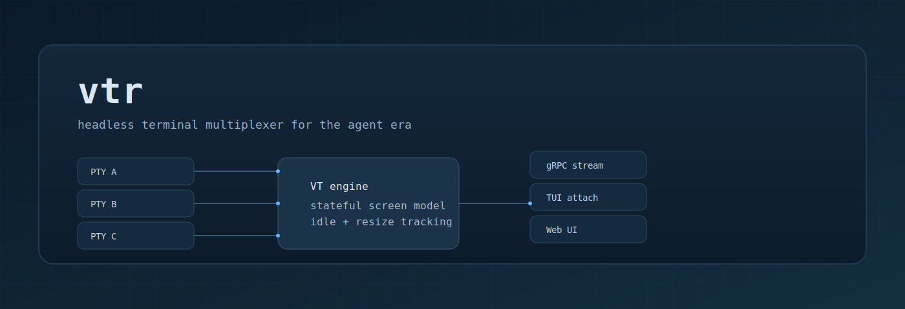

# vtr

vtr is a headless terminal multiplexer for the agent era. It separates PTY
lifecycle from rendering so that terminals can be driven by containers, agents,
CLI tools, or a web UI without tying the session to a single client.

## Why vtr

Classic multiplexers bind the terminal lifecycle to the renderer. vtr keeps a
central VT engine inside the coordinator, streams screen state over gRPC, and
lets any number of heterogeneous clients attach, detach, and render on their
own terms.

## Key features

- Headless coordinator that owns PTYs and a stateful VT engine.
- gRPC streaming of screen state, raw output, and idle events.
- TUI attach client and a web UI served via a WebSocket bridge.
- Session listing, resize, and input helpers for automation.
- Designed for containerized workloads and agent-driven workflows.

## Quickstart

Start a coordinator, spawn a session, and attach a TUI:

```bash
go run ./cmd/vtr serve --socket /tmp/vtr.sock

go run ./cmd/vtr spawn --socket /tmp/vtr.sock --cmd bash demo

go run ./cmd/vtr attach --socket /tmp/vtr.sock demo
```

Run the web UI:

```bash
go run ./cmd/vtr web --listen 127.0.0.1:8080 --socket /tmp/vtr.sock
```

## Docs

- `docs/spec.md` for architecture, CLI, and protocol details.
- `docs/streaming.md` for screen streaming behavior and resync rules.
- `docs/web-ui-smoke-tests.md` for the web UI workflow.

## Status

vtr is actively evolving; APIs and UX are still settling. Feedback and issues
are welcome.
