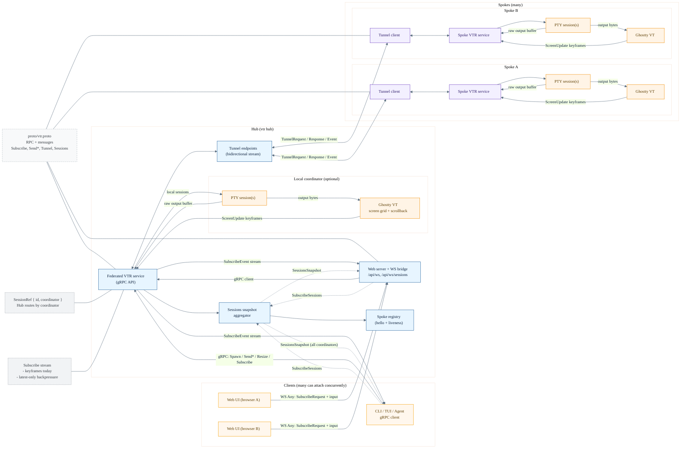

# vtr data flow (hub + spokes)

This diagram shows how bytes and screen state move through the system when a hub
routes traffic to multiple spokes while several UI clients and a CLI client attach
at the same time. It also highlights where the protobuf contract plugs in.

## Extension points (proto-first)

- `proto/vtr.proto` is the contract for gRPC, tunnel routing, and WebSocket `Any` frames.
- To add a new capability, add messages/RPCs in the proto, implement in `server/grpc.go`,
  and wire tunnel routing in `cmd/vtr/tunnel.go` (hub + spoke). If it needs Web UI
  support, handle the new `Any` type in `cmd/vtr/web_cmd.go` and `web/src/lib/ws.ts`.
