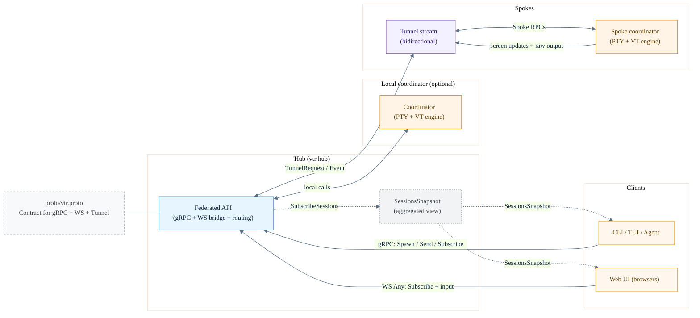

# vtr data flow (simplified)

This is a minimal, high-level view of how data flows when multiple clients
attach to a hub that routes to local sessions and spokes.

## Extension points (proto-first)

- Add messages/RPCs in `proto/vtr.proto`.
- Implement server behavior in `server/grpc.go`.
- If routed to spokes, wire `cmd/vtr/tunnel.go` (hub + spoke).
- If used by Web UI, handle the new `Any` type in `cmd/vtr/web_cmd.go` and `web/src/lib/ws.ts`.
